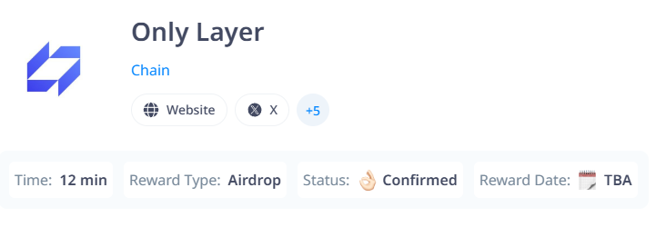

# ONLY LAYER


OnlyLayer | Next-Gen Consumer Blockchain Built for everyone. Fast, secure, and scalable with ZK-OPVM tech.
- WEBSITE https://onlylayer.com/
- TWITTER [@onlylayer](https://x.com/onlylayer)


## Features

- **Auto Transaction Swap**
- **Auto Generate New Wallets**
- **Send Faucet To New Address**
- **Send Faucet To Existing Address**
- **All Wallets information Saved In wallet.json** 

## Requirements

- **Node.js**: Ensure you have Node.js installed.
- **npm**: Ensure you have npm installed.


## Setup

1. Clone this repository:
   ```bash
   git clone https://github.com/Zlkcyber/only-layer.git
   cd only-layer
   ```
2. Install dependencies:
   ```bash
   npm install
   ```
3. Setup: to create new wallets and send faucet
   ```bash
   npm run setup
   ```
4. Run The Script:
   ```bash
   npm run start
   ```
5. Additional Feature: 

- send faucet to existing address

    ```bash
    npm run faucet
    ```
- Auto Deploy simple contract and interact
   ```bash
   npm run deploy
   ```


## 

This project is licensed under the [MIT License](LICENSE).
